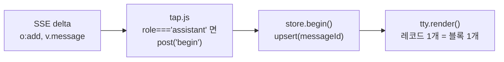

# 응답이 여러 블록으로 쪼개져 보인다

- 상태: **해결** (2026-09-01) — 수정 A 적용. B 는 안전망으로 유지
- 작성: 2026-08-31
- 관련 파일: `src/main/tap.js`, `src/content/store.js`, `src/content/tty.js`

## 증상

채팅을 보내면 GPT 응답이 **여러 번에 걸쳐 별도 블록으로** 스크롤백에 쌓인다.
최종 응답 하나만 남아야 한다.

## 한 줄 원인

`tap.js` 가 스트림에서 **`author.role === "assistant"` 인 모든 메시지**를 각각 새 응답으로 올린다.
추론 모델은 한 번의 응답에 assistant 역할 메시지를 여러 개 흘리는데, 원본 UI 는 그중 하나만 그리고
우리는 전부 그린다.

## 원인 경로



세 지점 모두 필터가 없다.

**1. `src/main/tap.js` — 무조건 새 메시지로 취급한다**

```js
if (op === 'add' && o.v && o.v.message) {
  const m = o.v.message;
  const role = m.author && m.author.role;
  if (role !== 'assistant') return;      // ← 거르는 건 역할뿐이다
  this.messageId = m.id || null;
  ...
  post('begin', { id: this.messageId, role, model: this.model, text: this.text });
}
```

`content.content_type`, `recipient`, `metadata` 를 보지 않는다. 추론 조각·툴 호출·중간 산출물이
전부 `role: "assistant"` 로 오면 그대로 통과한다.

**2. `src/content/store.js` — messageId 마다 새 레코드**

```js
const upsert = (m) => {
  const existing = m.id && state.byId.get(m.id);
  if (existing) { Object.assign(existing, m); return existing; }
  state.messages.push(rec);   // ← 새 id 면 무조건 추가
};
```

`begin` 이 N번 오면 레코드가 N개 생긴다. 합치거나 대체하는 규칙이 없다.

**3. `src/content/tty.js` — 레코드 1개당 블록 1개**

```js
s.messages.forEach((m) => {
  ui.scroll.appendChild(m.role === 'user' ? turnUser(m) : turnAssistant(m));
});
```

## 근거

측정한 것 (2026-08-31, 로그인 세션):

| 확인한 것 | 값 |
|---|---|
| 사용 중 모델 슬러그 | `gpt-5-6-thinking` — **추론 모델** |
| 렌더된 DOM 의 턴당 assistant `[data-message-id]` 노드 | **1개** (3턴 → 3노드) |
| 우리 스트림 경로가 만드는 레코드 | 턴당 1개 이상 (필터 없음) |

원본 UI 는 턴당 정확히 하나만 노출한다. **거르는 쪽은 원본이고, 우리는 안 거른다.** 이 차이가 증상 그대로다.

## 왜 `harvest` 는 멀쩡한가

`harvest` 는 DOM 의 `[data-message-id]` 를 읽는다. 원본이 이미 걸러놓은 결과라 턴당 1개가 나온다.
그래서 **페이지를 새로 열거나 `:reload` 를 하면 정상으로 보이고, 새로 대화를 치면 다시 쪼개진다.**
증상이 간헐적으로 느껴진다면 이 때문이다.

## 확정 / 미정

- `[확정]` 필터 부재는 코드에 있는 그대로다. 위 세 인용이 전부다.
- `[확정]` 원본 DOM 은 턴당 assistant 노드 1개다. 실측했다.
- `[확정]` 현재 계정이 쓰는 모델은 추론 모델(`gpt-5-6-thinking`)이다.
- `[미정]` **스트림에서 무엇을 보고 걸러야 하는지**. 후보는
  `content.content_type`(`"thoughts"` 등), `recipient !== "all"`,
  `metadata.is_visually_hidden_from_conversation`.
  `/backend-api/conversation/<id>` 와 `/backend-api/f/conversation/<id>` 는 둘 다 404 라
  대화 원본 JSON 으로는 확인하지 못했다. **생성 중 스트림을 한 번 떠야 확정된다.**

## 수정 방향

### A. 스트림에서 거른다 (추천)

`tap.js` 의 `add` 처리에 판별식을 넣어 최종 응답만 `begin` 시킨다.
`[미정]` 항목이 풀려야 정확한 조건을 쓸 수 있다.

거르지 못한 종류가 나오면 조용히 늘어나는 게 아니라 `soft()` 경고를 남기도록 붙인다.

### B. messageId 를 턴에 종속시킨다

`begin` 이 이미 스트리밍 중인 턴에서 또 오면 새 레코드를 만들지 않고 **직전 레코드를 대체**한다.
판별식 없이도 "마지막 것만 남는다"가 성립한다. A 보다 거칠지만 `[미정]` 을 안 풀고도 적용된다.
추론 과정을 접어서 보여주고 싶다면(02·03 아트보드의 `⏵ thinking`) 이 방향은 그 정보를 버린다.

### C. 스트림 종료 후 harvest 로 정정

`message_stream_complete` 뒤에 `harvest` 를 한 번 돌려 DOM 기준으로 덮어쓴다.
확실하지만 응답이 끝난 뒤 화면이 한 번 재배치된다.

**추천: B 를 먼저 넣어 증상을 없애고, 스트림을 실제로 떠서 `[미정]` 을 푼 뒤 A 로 교체한다.**
C 는 A/B 와 무관하게 안전망으로 같이 둘 만하다.

## 적용한 것 — B (2026-08-31)

`src/content/store.js` 에 **턴 자리(slot)** 개념을 넣었다.

- 턴마다 assistant 레코드 자리를 하나만 둔다 (`state.slotId`).
- 같은 턴에서 `begin` 이 또 오면 새 줄을 만들지 않고 **그 자리를 대체**한다 (`supersede`).
- 자리는 **사용자 메시지가 올 때만** 비워진다. 스트림이 끝났다고 비우면
  `end → begin` 순서로 오는 후속 메시지가 다시 새 줄로 쌓인다.
- 대체 횟수를 `state.superseded` 에 센다. `:health` 에서 볼 수 있다 —
  이 숫자가 곧 "원본이 감춘 중간 메시지가 몇 개였나"이고, A 를 설계할 때 쓸 재료다.

`tap.js` 는 손대지 않았다. 스트림에 무엇이 오는지 그대로 보고하게 두어야 A 로 넘어갈 때 근거가 남는다.

회귀 테스트: `test/store.test.mjs` (13 케이스). 중간 메시지 대체, `end→begin` 후속,
턴 경계, 순서 유지, 옛 id 정리, harvest 초기화를 검사한다.

## 수정 A 적용 (2026-09-01) — 근본 해결

`[미정]` 이던 판별자를 실측으로 확정했다. `/backend-api/conversation/<id>` 를
**Bearer 토큰과 함께** 부르면 200 이 온다(전에 404 였던 건 인증 헤더가 없어서였다).

한 대화의 `mapping` 15개 노드를 분류한 결과:

| 분류 | 개수 | `content_type` | `recipient` | `end_turn` |
|---|---|---|---|---|
| 사용자 | 6 | `text` | `all` | `null` |
| **최종 응답** | 6 | **`text`** | `all` | **`true`** |
| **추론 조각** | 3 | **`reasoning_recap`** | `all` | **`false`** |

추론 노드에는 `metadata.reasoning_status` · `reasoning_start_time` · `reasoning_end_time` 도 붙는다.

그래서 `tap.js` 의 판별식은 이렇게 확정됐다.

```js
const ctype = m.content && m.content.content_type;
const rcp = m.recipient == null ? 'all' : m.recipient;
if (ctype !== 'text' || rcp !== 'all') { /* 본문 아님 */ }
```

`content_type` 을 쓰는 이유: `end_turn` 은 응답이 끝나야 채워지는데
스트림의 `add` 시점에는 아직 없다. `content_type` 은 생성 시점에 정해진다.

**판별자가 낡으면 알린다.** 스트림이 끝났는데 본문을 한 번도 못 잡았으면
건너뛴 `content_type` 목록과 함께 경고한다 — 조용히 빈 응답을 보여주지 않는다.

**B 는 남겨뒀다.** 모르는 종류가 새로 생겨도 한 턴에 두 줄이 되지는 않게 하는 안전망이다.

### 덤 — 추론 표시

추론 조각을 버리지 않고 개수만 세서 응답 위에 `⏵ thinking ×2` 한 줄로 남긴다.
원본이 추론 본문을 주지 않으므로 내용은 표시할 수 없다.

### B 가 못 하는 것

- 추론 과정을 **버린다**. 02·03 아트보드의 `⏵ thinking` 접기는 A 가 들어와야 가능하다.
- 원본이 최종 응답 **뒤에** 다른 assistant 메시지를 붙이는 경우(있다면) 최종 응답이 덮인다.
  판별식이 없으니 "마지막이 최종"이라는 가정에 기댄다. `:health` 의 대체 횟수가
  예상보다 크면 이 가정을 의심할 것.

## 곁가지로 발견한 것 — 별건

같은 조사에서 나왔다. 이 이슈와 원인이 다르다.

**진입 경로에 따라 원본이 턴을 다 그리지 않아 `harvest` 가 앞부분을 놓친다.**
별도 이슈로 분리했다 → `docs/issue/2026-08-31-partial-thread-harvest.md` (완화 적용됨).
처음에 '가상화'로 적었으나 후속 측정에서 아니었다. 콜드 로드에서 안 그려지고, 스크롤해도 안 붙는다.

## 검증 방법

수정 후 확인. 추론 모델에서 새 대화로 한 번 보내고:

```js
// 페이지 콘솔 (MAIN world)
// 응답 1회에 begin 이 몇 번 오는지 센다. 1이어야 한다.
let n = 0;
window.addEventListener('message', (e) => {
  const d = e.data;
  if (d && d.__gpt_term__ && d.dir === 'm2i' && d.kind === 'begin') console.log('begin', ++n, d.payload.id);
});
```

터미널에서는 `:health` 로 걸러진 종류에 대한 경고가 남는지 함께 본다.
